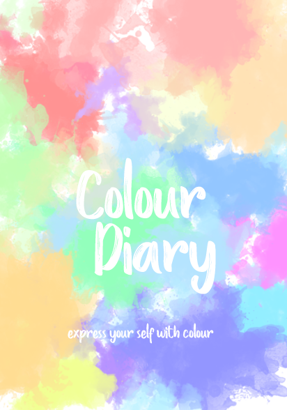

# Colourdiary

Colourdiary is visual diary that represents your mood for a week and a month. You express your mood by colour 
and colourdiary will log all the information and display it to you as a colour graph. 

Colourdiary is private and it will log and display how you feel. 

User Story
-As a user I would like to click on the colour button and get that recorded into the data.
-As a user I would like to view weekly colour data
-As a user I would like to view monthly colour data
-As a user I know Harrison would want me to write 3 tests at least. Try to write test for route(function) but also 
for the server as well.

Stretch 
-I would like my friend to use colourdiary as well. Creat add user function.
-Privacy is important. Make passward function available. 
-My friend would like to see weekly and monthly colour chart as well. 
-When user identify themselves as angry or sad for over three days alert them with encouraging message?.

